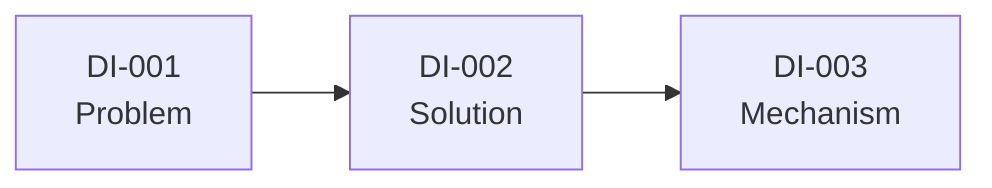

# Progressive Disclosure / Zettelkasten-style Notes

Represent knowledge as a network of small, atomic notes rather than a
linear document. The premise: experts don't store knowledge as a
top-to-bottom narrative, they store it as richly cross-linked concepts
they can enter from any point — so notes structured this way mirror how
the knowledge will actually be recalled and used later, rather than how
it was first explained.

## When to use this skill

- User asks for "zettelkasten", "linked notes", "note graph",
  "progressive disclosure"
- Topic has many interrelated sub-concepts where a single linear reading
  order would be somewhat arbitrary (any concept where "it depends which
  part you already know" is true)
- User wants something they'll come back to and browse repeatedly, not
  read once start-to-finish

## Language

Always respond in the same language the user is writing in — do not
default to English. Detect the language from the user's most recent
message and write every note's title and body, the link labels, and the
closing usage instructions in that language. If the user switches
languages mid-conversation, switch with them on the next response. Note
IDs stay in the `PREFIX-NNN` Latin-numeral format regardless of language
(see Structure below) for stable cross-referencing. Code and code
comments may stay in English regardless of the surrounding language,
following normal programming convention.

## Structure

Each note:

```markdown
### 🔖 `PREFIX-NNN` — [short, specific title]

[2-5 sentences OR one focused code block. One idea only.]

[optional: one small Mermaid diagram — see "Per-note diagrams" below]

→ Liên quan: `PREFIX-XXX` (why it's related, in a few words), `PREFIX-YYY` (...)
```

(The "Liên quan" label above is one worked example, meaning "Related" in
Vietnamese; translate it — and every other label in the note — into
whatever language the user is actually writing in, per the Language
section above. Keep the `🔖` marker and `PREFIX-NNN` ID format regardless
of language.)

### Per-note diagrams (optional)

A note may include its own small ` ```mermaid ` diagram, in addition to
its prose, when the idea is inherently a shape — a decision/branch, a
blocking or sequencing behavior, a state transition, a small pipeline —
and the diagram would let the reader see that shape faster than the
sentence would. Good candidates: "which of these two do I pick and
why" (`flowchart TD` with a decision node), "what blocks on what and in
which order" (`sequenceDiagram`), "what state can this be in and what
moves it to the next one" (`stateDiagram-v2`).

Don't add one to every note by default — most atomic notes are well
served by prose or a code listing alone. Add a per-note diagram only
where it earns its place: if the diagram would just be a picture of the
title, skip it. Keep it small (3-6 nodes) — a per-note diagram that
needs the same scale as the closing link map belongs in that link map
instead, not repeated here.

Rules for individual notes:
- **One idea per note.** If explaining the note requires a "and also..."
  digression, that digression is a separate note with its own link.
- **Self-contained but not redundant.** A note should make sense read in
  isolation (don't assume the reader just read the previous note) but
  shouldn't re-explain concepts that have their own note — link instead.
- **IDs are stable and sequential** within a topic prefix (e.g. `DI-001`,
  `DI-002`...) so links remain valid as the set grows.
- **Every note has at least one link**, usually 2-3. A note with zero
  links is a sign it should be merged into a related note or the link
  was missed.
- Links are asymmetric-friendly: note A can link to note B without B
  necessarily linking back, if the relationship only matters in one
  direction (e.g. a specific example linking to the general principle it
  illustrates, without the principle needing to link every example).

## Required closing section: link map

After all individual notes, include a **Mermaid flowchart** in a
` ```mermaid ` fenced block showing the overall connection structure —
not just a repeat of each note's own links, but a bird's-eye view of
clusters and the main paths through the material. GitHub, Obsidian, VS
Code (with the Markdown Preview Mermaid extension), and Claude Artifacts
all render Mermaid natively straight out of the `.md` file, so this is
an actual rendered graph for the reader, not text pretending to be one.

Build one node per note (`PREFIX-NNN["PREFIX-NNN<br/>Short title"]`) and
one edge per link declared in that note's own "→ Liên quan" /
"→ Related" line — the graph should be a direct, mechanical rendering
of the links you already wrote, not a separately-invented summary:



Use `flowchart LR` for topics that read left-to-right (a rough
progression exists) and `flowchart TD` when the structure is more
clustered/hub-like than linear. Keep node labels to the ID plus a 1-4
word title — full explanations belong in the notes themselves, not the
graph.

If a renderer without Mermaid support is a real possibility for this
user (e.g. a plain-text-only terminal), you may add a short ASCII
fallback diagram after the Mermaid block, but the Mermaid block is the
primary, required deliverable — don't substitute ASCII for it.

End with an explicit instruction for how to use the notes actively: pick
a note at random, try to recall its content before opening it, and only
follow a link when genuinely stuck — not "read top to bottom a second
time." This instruction is part of the deliverable, not optional
boilerplate — it's what makes the format function as retrieval practice
rather than just a differently-formatted document.

## What NOT to do

- Don't write notes that are actually sequential steps in disguise (note
  2 only makes sense after note 1) — that's a linear document wearing a
  Zettelkasten costume. If the content is genuinely sequential, this is
  the wrong format; suggest `worked-example` instead.
- Don't over-link — every note linking to every other note defeats the
  purpose of showing meaningful structure.
- Don't skip the link map — individual notes without the bird's-eye view
  lose the "network" property that's the whole point of the format.
- Don't make notes so short they lose standalone meaning (a title alone
  is not a note) or so long they stop being atomic (if it needs
  subheadings, split it into multiple linked notes).
